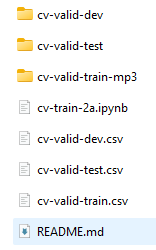

# ASR-TRAIN
## Directory Setup
Transfer necessary folders and csv files from extracted common_voice into directory as such:

Rename the cv-valid-train folder to cv-valid-train-mp3

To run the retrained fine-tuned model without going through the training process, download the zip file from the link below and extract the folder into this directory

Fine-tuned model download: https://drive.google.com/file/d/1jHSru8USgb8LoSxfVbpo5s418IF-ZABg/view?usp=sharing
