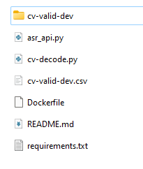

# ASR
## Directory Setup
Transfer the cv-valid-dev folder of audio mp3 into the directory as such:

Make sure to transfer the original "cv-valid-dev.csv" file into the directory too.

## Run DockerFile

### Build
`docker build -t asr-api .`

### Run
`docker run -p 8001:8001 asr-api`

### Model Inference
`curl -F "file=@<path_to_mp3>" http://localhost:8001/asr`
